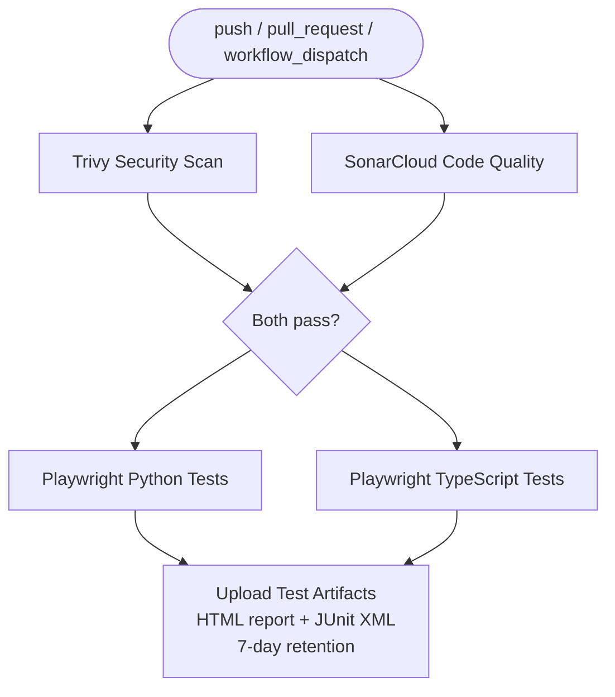

# SDET CI/CD Training
**Stratpoint Technologies | SDET QA Initiative**

A hands-on training program for SDETs to integrate Playwright test suites into a GitHub Actions CI/CD pipeline with security scanning, code quality gates, and test artifact reporting.

---

## What's in This Repo

| Folder | Description |
|---|---|
| `repo-starter/` | Scaffolded template with TODOs — what trainees fork and complete |
| `repo-solution/` | Fully working reference implementation |
| `SDET_CICD_Training_Outline.md` | Self-paced course outline (8–10 hours) |
| `SDET_CICD_Training_Outline_InstructorLed.md` | Instructor-led workshop variant (2 days) |

---

## Getting Started — Set Up Your Training Repo

Each trainee creates their own GitHub repository from the `repo-starter` template. Follow the steps below.

### Option A — Upload via GitHub UI (no Git required)

1. **Create a new repository** on [github.com/new](https://github.com/new)
   - Name it something like `sdet-cicd-training`
   - Set visibility to **Private**
   - Do **not** initialize with a README (leave all checkboxes unchecked)
   - Click **Create repository**

2. **Download the starter files**
   - Download or copy the contents of the `repo-starter/` folder from this training repo

3. **Upload files to your new repo**
   - On your new repo page, click **uploading an existing file**
   - Drag and drop all files and folders from `repo-starter/`
   - Commit directly to `main`

---

### Option B — Push via Git CLI (recommended)

> Prerequisites: [Git](https://git-scm.com/downloads) installed, GitHub account authenticated

**Step 1 — Create a new empty repo on GitHub**

Go to [github.com/new](https://github.com/new) and create a new **private** repo named `sdet-cicd-training`. Do not initialize it with any files.

**Step 2 — Copy the starter files to a new local folder**

```bash
# From the root of this training repo
cp -r repo-starter/ ~/sdet-cicd-training
cd ~/sdet-cicd-training
```

**Step 3 — Initialize and push to your GitHub repo**

```bash
git init
git add .
git commit -m "Initial commit: SDET CI/CD training starter"
git branch -M main
git remote add origin https://github.com/<your-username>/sdet-cicd-training.git
git push -u origin main
```

Replace `<your-username>` with your GitHub username.

---

### Option C — Fork This Repo (if this training repo is on GitHub)

> Use this option only if the instructor has published this repo to GitHub and granted you access.

1. Open the training repo on GitHub
2. Click **Fork** (top right)
3. Select your personal account as the destination
4. After forking, navigate to the `repo-starter/` contents on your fork

> Note: If you fork the entire repo, your work will include both `repo-starter` and `repo-solution`. Consider creating a separate repo from `repo-starter` only (Option B) to avoid accidentally referencing the solution.

---

## After Setup — Required Configuration

### 1. Enable GitHub Actions

Go to your repo → **Settings → Actions → General** → set to **Allow all actions** → Save.

### 2. Add Repository Secrets

Go to **Settings → Secrets and variables → Actions → New repository secret**

| Secret Name | Value |
|---|---|
| `SONAR_TOKEN` | Your SonarCloud token (from [sonarcloud.io](https://sonarcloud.io)) |

### 3. Update SonarCloud Config

Edit `sonar-project.properties` and set your own project key and organization:

```properties
sonar.projectKey=<your-github-username>_sdet-cicd-training
sonar.organization=<your-sonarcloud-org>
```

---

## Tech Stack

| Layer | Technology |
|---|---|
| Test frameworks | Playwright 1.43 — Python (pytest) + TypeScript (@playwright/test) |
| CI/CD | GitHub Actions |
| Security scanning | Trivy |
| Code quality | SonarCloud |
| Reporting | Playwright HTML reporter + JUnit XML |
| Target app | [saucedemo.com](https://www.saucedemo.com) |

---

## Target Pipeline (What You'll Build)



---

## Lab Modules

| Module | Topic |
|---|---|
| Module 2 | Explore the repo structure and workflow YAML |
| Module 3 | Write your first GitHub Actions workflow |
| Module 4 | Run Playwright tests in CI |
| Module 5 | Add quality gates — block pipeline on failure |
| Module 6 | Publish HTML test report as a pipeline artifact |
| Module 8 | POC — build your assigned scenario end-to-end |

See `SDET_CICD_Training_Outline.md` for the full self-paced guide, or `SDET_CICD_Training_Outline_InstructorLed.md` for the workshop version.

---

## Reference

- Starter repo guide: [`repo-starter/README.md`](repo-starter/README.md)
- Solution reference: [`repo-solution/README.md`](repo-solution/README.md)
- Target site credentials: username `standard_user` / password `secret_sauce`
