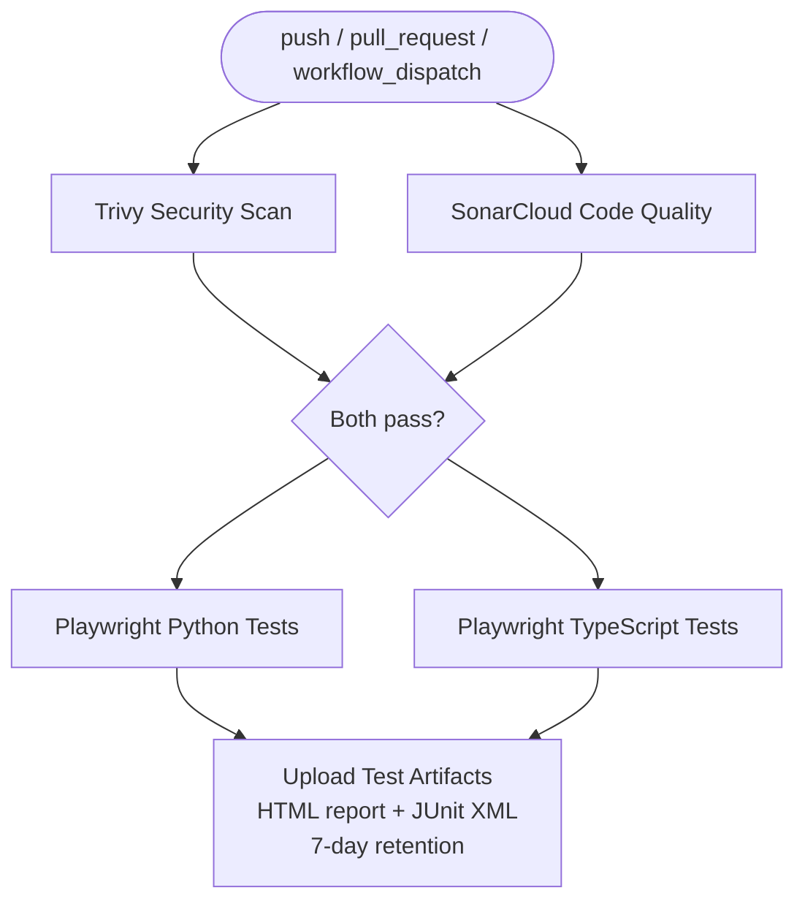

# SDET CI/CD Training — Solution Repo
**Stratpoint Technologies | SDET QA Initiative**

> This is the **fully working reference implementation**. Use it to verify your output or unblock yourself during labs.

## Branches

| Branch | Purpose |
|---|---|
| `starter` | Scaffolding with TODOs — fork this to begin labs |
| `solution` | Fully working reference — use to verify your output |

## Structure

```
├── .github/
│   └── workflows/
│       └── playwright.yml           # GitHub Actions CI/CD pipeline
├── playwright-python/               # Playwright Python test suite
│   ├── pages/                       # Page Object Models (LoginPage, InventoryPage, CartAndCheckoutPage)
│   ├── tests/                       # Test files (login, cart, products, checkout)
│   ├── conftest.py                  # pytest fixtures and configuration
│   ├── pytest.ini                   # pytest settings
│   └── requirements.txt
├── playwright-typescript/           # Playwright TypeScript test suite
│   ├── pages/                       # Page Object Models (LoginPage, InventoryPage, CartAndCheckoutPage)
│   ├── tests/                       # Test specs (.spec.ts)
│   ├── playwright.config.ts         # Playwright configuration
│   └── package.json
├── sonar-project.properties         # SonarCloud configuration
└── README.md
```

## Tech Stack

| Layer | Technology |
|---|---|
| Test frameworks | Playwright 1.43 — Python (pytest) and TypeScript (@playwright/test) |
| CI/CD | GitHub Actions |
| Security scanning | Trivy (filesystem, CRITICAL/HIGH severity) |
| Code quality | SonarCloud |
| Reporting | Playwright HTML reporter + JUnit XML |
| Target app | [saucedemo.com](https://www.saucedemo.com) |

## CI/CD Pipeline



Jobs only run if both quality gates pass (`needs: [security-scan, code-quality]`).

## Test Coverage

Both suites cover the same scenarios using the Page Object Model pattern:

| Scenario | Description |
|---|---|
| Login — valid | Standard user logs in successfully |
| Login — invalid | Error message shown for bad credentials |
| Login — empty fields | Validation message shown |
| Logout | User can log out from inventory page |
| Add to cart | Item added, cart count increments |
| Product sorting | Sort A→Z works correctly |
| Checkout | End-to-end purchase flow completes |
| Product detail | Product page shows correct info |

## Running Locally

**TypeScript:**
```bash
cd playwright-typescript
npm install
npx playwright install --with-deps
npm test
```

**Python:**
```bash
cd playwright-python
pip install -r requirements.txt
playwright install --with-deps
pytest
```

## Target Site Credentials

All tests run against **[saucedemo.com](https://www.saucedemo.com)**

| Credential | Value |
|---|---|
| Username | `standard_user` |
| Password | `secret_sauce` |

Override via environment variables: `BASE_URL`, `SAUCE_USERNAME`, `SAUCE_PASSWORD`

## Lab Modules

| Module | What You Build |
|---|---|
| Module 2 | Fork repo, read the workflow YAML |
| Module 3 | Write your first GitHub Actions workflow |
| Module 4 | Run Playwright tests in CI |
| Module 5 | Add quality gates — Trivy + SonarCloud |
| Module 6 | Publish HTML test report as artifact |
| Module 8 | POC — build your assigned scenario end-to-end |
