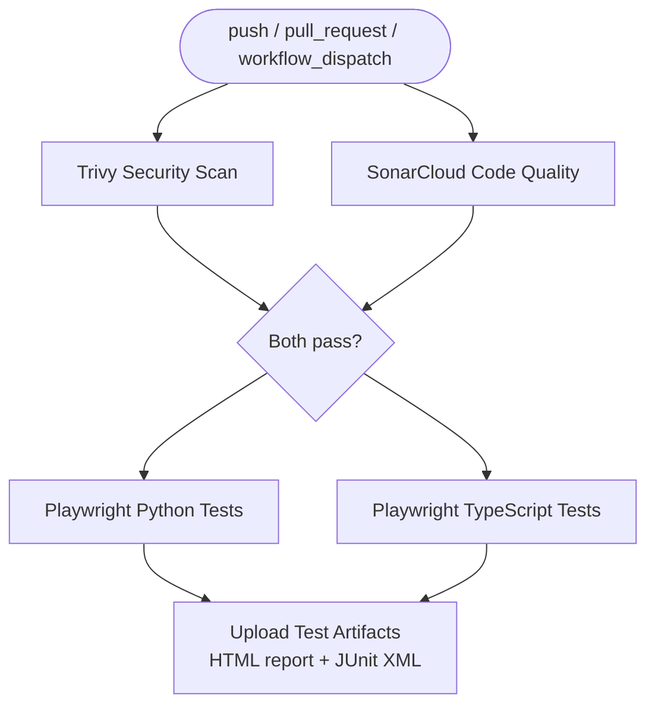

# SDET CI/CD Training — Starter Repo
**Stratpoint Technologies | SDET QA Initiative**

> ⚠️ This is the **starter branch**. It contains scaffolding and TODOs for you to complete during the labs.
> The fully working reference is on the `solution` branch.

## Your Task

Complete each `# TODO` in the source files to make both test suites run end-to-end inside a GitHub Actions pipeline with security scanning, code quality gates, and artifact reporting.

## Structure

```
├── .github/
│   └── workflows/
│       └── playwright.yml           # TODO: complete the pipeline (Modules 3–6)
├── playwright-python/               # Playwright Python suite
│   ├── pages/                       # Page Object Models — complete the locators
│   ├── tests/                       # Tests — complete the assertions
│   ├── conftest.py                  # pytest fixtures
│   ├── pytest.ini
│   └── requirements.txt
├── playwright-typescript/           # Playwright TypeScript suite
│   ├── pages/                       # Page Object Models — complete the locators
│   ├── tests/                       # Tests — complete the assertions
│   ├── playwright.config.ts
│   └── package.json
├── sonar-project.properties         # SonarCloud config — update with your project key
└── README.md
```

## Lab Checklist

- [ ] **Module 2** — Fork this repo and explore the structure
- [ ] **Module 3** — Complete `playwright.yml` to install dependencies and run tests
- [ ] **Module 4** — Verify your tests pass in the GitHub Actions pipeline
- [ ] **Module 5** — Add quality gates (Trivy security scan + SonarCloud) that block on failure
- [ ] **Module 6** — Publish the HTML test report as a pipeline artifact
- [ ] **Module 8** — Complete your assigned POC scenario end-to-end

## Target Site

All tests run against **[saucedemo.com](https://www.saucedemo.com)**

| Credential | Value |
|---|---|
| Username | `standard_user` |
| Password | `secret_sauce` |

## Running Locally

Verify your implementation works locally before pushing to CI.

**TypeScript:**
```bash
cd playwright-typescript
npm install
npx playwright install --with-deps
npm test
```

**Python:**
```bash
cd playwright-python
pip install -r requirements.txt
playwright install --with-deps
pytest
```

## Pipeline Architecture (Target State)



## Need Help?

Compare your work against the `solution` branch or ask your instructor.
